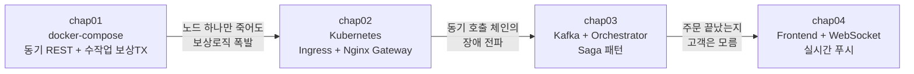
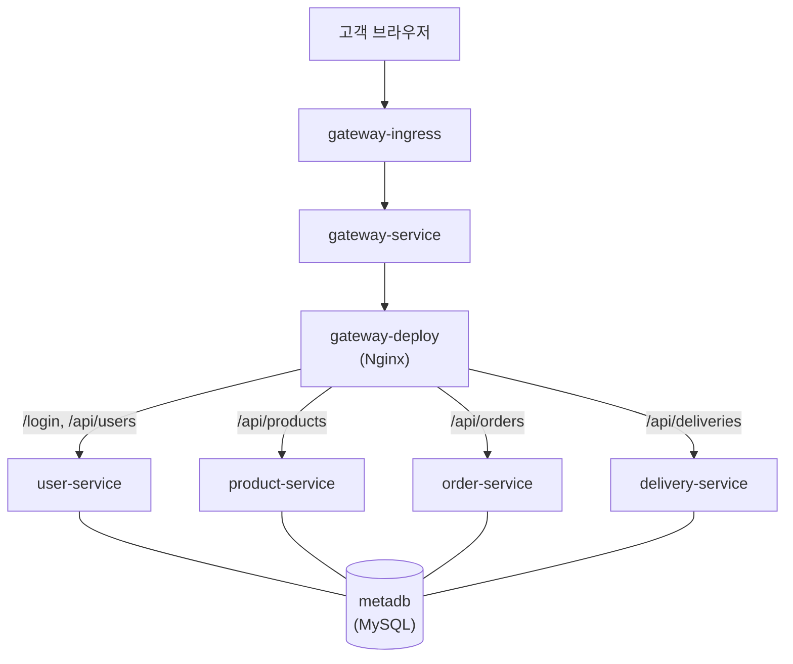
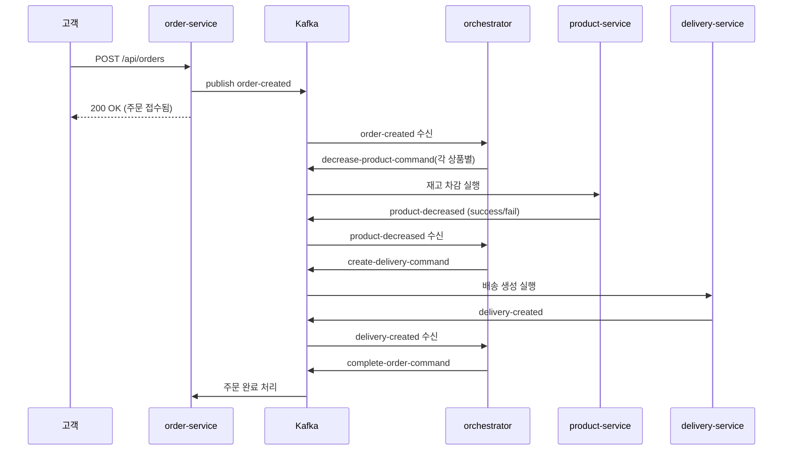
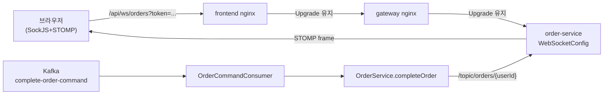

# 인프라와 MSA 설계 — 네 개의 가게, 한 권의 고군분투기

> 같은 쇼핑몰을 네 번 다시 짓는 이야기. `chap01 → chap04` 로 흘러가면서
> "직전 방식의 아픔" 이 "다음 도구를 불러들이는 이유" 가 된다.

---

## 프롤로그 — 쇼핑몰 한 채를 짓는다

이 책에는 네 개의 가게가 나온다.

| 가게 | 하는 일 | 서비스 |
|------|---------|--------|
| 회원 상담소 | 손님 신원 확인, 토큰 발급 | `user-service` (8083) |
| 상품 창고 | 상품 등록·재고 관리 | `product-service` (8082) |
| 주문 카운터 | 주문 접수·상태 관리 | `order-service` (8081) |
| 택배 접수대 | 배송 생성·취소 | `delivery-service` (8084) |

네 가게는 한 팀이지만 서로 다른 점포다. 한 건물에 있을 수도, 골목에
흩어져 있을 수도, 심지어 전화 대신 사내 방송으로 대화할 수도 있다.
어떤 형태든 **"고객이 주문 버튼을 누르는 순간, 네 점포가 한 마음처럼
움직이게 만드는 것"** 이 이 프로젝트의 숙제다.

여정은 네 단계로 진행된다.



각 장의 구조는 같다. **어떤 비유인가 → 어떻게 설계했나 → 어디서
아팠나 → 그래서 다음 장에서 무엇을 바꾸게 되었나.**

---

## 1장. 시장 골목상가 — `chap01`, docker-compose

### 비유: 골목에 나란히 선 네 점포

네 가게가 시장 골목에 있다. 손님이 주문 카운터에 주문서를 던지면,
카운터 직원이 주문서를 들고 **옆 가게(상품 창고)로 직접 뛰어가** 재고를
빼 달라고 부탁한다. 그다음엔 택배 접수대로 달려가 배송 접수를 넣는다.
중간에 어느 한 가게가 문을 닫았거나 직원이 자리를 비웠다면?
카운터 직원이 지금까지 돌려놓은 일들을 **손으로 하나씩 되감는다.**

이것이 `chap01` 의 세계다.

### 설계

`chap01/docker-compose.yml:1-35` — 네 서비스가 같은
`msa-network` 브리지에 올라간다.

```yaml
# chap01/docker-compose.yml
services:
  user-service:    ports: ["8083:8083"] ; networks: [msa-network]
  product-service: ports: ["8082:8082"] ; networks: [msa-network]
  order-service:   ports: ["8081:8081"] ; networks: [msa-network]
  delivery-service:ports: ["8084:8084"] ; networks: [msa-network]
```

주문 서비스는 두 어댑터로 옆 가게와 통신한다.

```java
// chap01/order/.../adapter/ProductClient.java:15-19
this.restClient = restClientBuilder
        .baseUrl("http://product-service:8082")   // 옆 가게 주소를 코드에 박음
        .build();
```
```java
// chap01/order/.../adapter/DeliveryClient.java:12-15
.baseUrl("http://delivery-service:8084")
```

### 아픔 1 — 수작업 보상 트랜잭션

`chap01/order/.../orders/OrderService.java:23-66` 는 "분산 트랜잭션을
애플리케이션 코드 한복판에 손으로 심어 둔" 교과서적 예시다.

```java
// 보상을 위한 수기 장부
List<ProductRequest> decreasedProducts = new ArrayList<>();
boolean deliveryCreated = false;

try {
    createdOrder = orderRepository.save(Order.create(userId));
    for (OrderRequest.OrderItemDTO item : orderItems) {
        productClient.decreaseQuantity(...);
        decreasedProducts.add(req);    // 성공한 것만 기록
    }
    ...
    deliveryClient.createDelivery(...);
    deliveryCreated = true;
    createdOrder.complete();
} catch (Exception e) {
    if (deliveryCreated) deliveryClient.cancelDelivery(...);
    decreasedProducts.forEach(req -> productClient.increaseQuantity(req));
    throw new Exception500("주문 생성 중 오류가 발생했습니다: " + e.getMessage());
}
```

- 어느 단계까지 성공했는지 **변수 두 개**(`decreasedProducts`,
  `deliveryCreated`) 로 추적한다.
- 예외가 나면 **반대 순서로 되감기** 를 직접 호출한다.
- "되감기 호출 자체가 또 실패하면?" 은 이 코드의 사각지대다.

### 아픔 2 — 주소가 코드에 박혀 있다

`ProductClient` 와 `DeliveryClient` 는 옆 가게 주소를 **생성자에 하드코딩**
한다. 포트가 바뀌거나 서비스 이름이 바뀌면 이미지 자체를 다시 빌드해야
한다. 도커 네트워크 이름(`product-service`)에 강결합된 상태다.

### 아픔 3 — 동기 호출 사슬의 도미노

주문은 `상품 → 배송` 순으로 **동기 REST** 로 묶여 있다. 상품 서비스가
0.5초 느리면 주문도 0.5초 느리고, 배송이 타임아웃 나면 주문 전체가
실패한다. 네 가게가 한 줄로 묶인 연결 줄넘기 같다.

> **코드에서 확인하기**
> - `chap01/docker-compose.yml`
> - `chap01/order/src/main/java/com/metacoding/order/orders/OrderService.java`
> - `chap01/order/src/main/java/com/metacoding/order/adapter/ProductClient.java`
> - `chap01/order/src/main/java/com/metacoding/order/adapter/DeliveryClient.java`

### 이 장의 교훈

네 가게가 서로의 전화번호를 외우고 있는 구조는 오래 못 간다.
**주소를 외부화(환경변수/디스커버리)** 하고, **장애 격리(비동기/리트라이)**
수단이 필요하다. → 2장에서 건물로 이사 간다.

---

## 2장. 건물로 이사 — `chap02`, Kubernetes

### 비유: 네 사무실이 한 건물로 들어온다

골목 점포가 **4층짜리 오피스 빌딩** 으로 이전했다.
- **1층 안내 데스크** 가 있어서 손님은 무조건 여기로 들어온다 (Ingress).
- 안내 직원이 목적지에 맞게 층을 알려준다 (Nginx Gateway + `location /api/*`).
- 각 사무실에는 **이름표(Service), 사원증(Secret), 업무 매뉴얼(ConfigMap)**
  이 따로 붙어 있어서 주소·비밀번호를 코드에 박을 필요가 없다.
- 건물 안에 공용 문서고가 생긴다 (DB Deployment + Service).

### 설계: 한 장의 그림



- `chap02/k8s/gateway/gateway-ingress.yml:1-16` — **현관**. 모든 HTTP
  요청이 `gateway-service:80` 으로 라우팅된다.
- `chap02/gateway/nginx.conf:20-43` — **층별 안내판**.
  ```nginx
  location /api/orders     { proxy_pass http://order-service;   }
  location /api/products   { proxy_pass http://product-service; }
  location /api/deliveries { proxy_pass http://delivery-service;}
  location /api/users      { proxy_pass http://user-service;    }
  ```
- `chap02/k8s/db/` — 공용 문서고 4종 세트.
  - `db-deployment.yml` : MySQL Pod
  - `db-service.yml` : 클러스터 내부 DNS 이름 부여
  - `db-configmap.yml` : `DB_URL` 같은 평문 설정
  - `db-secret.yml` : 비밀번호
- 각 서비스의 `application-prod.properties` 가 `${DB_URL}`,
  `${MYSQL_PASSWORD}` 같은 환경 변수를 읽는다. **드디어 주소가 코드에서
  빠져나왔다.**

### 아픔 1 — 하지만 DB 는 여전히 하나다

`chap02/db/init.sql` 한 파일에 `users`, `product_tb`, `order_tb`,
`delivery_tb` 가 모두 모여 있다. "MSA 라면 DB per Service 라던데?"
라는 숙제를 **의식적으로 미뤄 둔 상태** 다. 장애 격리와 스키마 자율성은
아직 이 장의 관심사가 아니다.

### 아픔 2 — Secret 이 평문 YAML 에 있다

```yaml
# chap02/k8s/db/db-secret.yml:7-11
type: Opaque
stringData:
  MYSQL_ROOT_PASSWORD: root1234
  MYSQL_PASSWORD: metacoding1234
```

`stringData` 는 Base64 자동 인코딩을 해줄 뿐, 진짜 암호 관리가 아니다.
실무라면 Sealed Secrets, Vault, KMS 로 넘어가야 하는 단계다.

### 아픔 3 — 통신 방식은 그대로다

건물로 이사는 왔지만 **업무 방식(동기 REST 호출)은 그대로**다.
여전히 주문 서비스가 상품 서비스의 1층 안내 데스크를 거쳐 직접
호출하고, 장애가 나면 1장에서 봤던 수작업 보상 로직이 다시 등장한다.
배관은 바꿨지만 배관에 흐르는 물의 성질은 아직 그대로다.

> **코드에서 확인하기**
> - `chap02/k8s/gateway/gateway-ingress.yml`
> - `chap02/gateway/nginx.conf`
> - `chap02/k8s/db/db-secret.yml`
> - `chap02/db/init.sql`

### 이 장의 교훈

이사했지만 업무 방식이 그대로라, 한 층이 정전되면 여전히 전 층이 멈춘다.
**통신의 결합도를 낮춰야** 한다. → 3장에서 전화를 끊고 메신저를 도입한다.

---

## 3장. 전담 매니저의 등장 — `chap03`, Kafka + Saga Orchestrator

### 비유: 사내 메신저와 주문 매니저

건물 1층에 **주문 전담 매니저** 가 들어온다. 사무실들은 이제 서로에게
전화하지 않는다. 대신 사내 메신저(Kafka 토픽)에 **"주문 들어왔음",
"재고 빠졌음", "배송 접수됨"** 같은 쪽지를 던진다. 매니저가 이 쪽지를
읽고 **다음 사무실에게 할 일을 지시** 한다. 잘못되면 되돌리는 지시도
매니저가 내린다.

- **이벤트 토픽** : "무슨 일이 생겼다" 는 사실 — `order-created`,
  `product-decreased`, `delivery-created`, `order-cancelled`
- **명령 토픽** : "이거 해달라" 는 지시 — `decrease-product-command`,
  `increase-product-command`, `create-delivery-command`,
  `complete-order-command`, `cancel-order-command`

### 설계: 주문 한 건의 여정



- **발행 쪽** — `chap03/order/.../OrderService.java:24-45` 에서 REST
  호출이 **통째로 사라졌다**:
  ```java
  orderRepository.save(Order.create(userId));
  orderItemRepository.saveAll(createdOrderItems);
  orderEventProducer.publishOrderCreated(
      new OrderCreatedEvent(orderId, userId, address, messageItems));
  ```
  주문 서비스는 "주문이 들어왔다" 는 사실만 던진다. 뒷일은 모른다.
- **발행 어댑터** — `chap03/order/.../adapter/producer/OrderEventProducer.java:13-16`
  ```java
  public void publishOrderCreated(OrderCreatedEvent event) {
      kafkaTemplate.send("order-created", event);
  }
  ```
- **매니저** — `chap03/orchestrator/.../handler/OrderOrchestrator.java`
  는 세 개의 `@KafkaListener` 로 전 사가를 조율한다.
  - `orderCreated` (라인 20-40) : 각 상품마다 `decrease-product-command`
    발행.
  - `productDecreased` (라인 43-90) : 실패 시 **이미 성공했던 상품만**
    (`decreasedProductIds` 집합) `increase-product-command` 로 복구하고,
    `cancel-order-command` 로 주문을 취소한다. 성공이 모두 쌓이면
    `create-delivery-command` 발행.
  - `deliveryCreated` (라인 93-131) : 배송 성공이면
    `complete-order-command`, 실패면 재고 복구 + 주문 취소.
- **매니저의 수첩** — `WorkflowState` (라인 133-141) 는 주문 id 당
  진행 상태를 들고 있는 `ConcurrentHashMap` 엔트리다. 매니저가 없으면
  이 흐름은 돌아가지 않는다.
- **역방향 명령 수신** — `chap03/order/.../adapter/consumer/OrderCommandConsumer.java:15-23`
  ```java
  @KafkaListener(topics = "complete-order-command", groupId = "order-service")
  public void completeOrderCommand(CompleteOrderCommand command) {
      orderService.completeOrder(command.getOrderId());
  }
  ```

### 1장 코드와의 비교

| 구분 | `chap01/OrderService` | `chap03/OrderService` |
|------|----------------------|----------------------|
| 줄 수 | 67 줄 | 45 줄 |
| 예외 처리 | `try/catch` + 되감기 | 없음 (위임) |
| 보상 책임 | 주문 서비스 본인 | 오케스트레이터 |
| 호출 방식 | `RestClient.put(...)` x N | `kafkaTemplate.send(...)` 한 줄 |

### 아픔 1 — 상태는 어디 있나요?

`WorkflowState` 가 **매니저의 머릿속(인메모리 ConcurrentHashMap)** 에만
산다. 오케스트레이터 Pod 이 재시작되면 **진행 중이던 사가가 증발한다.**
실무에서는 이 상태를 Redis·DB·Kafka Streams 같은 외부 저장소로 빼거나,
이벤트 소싱으로 재구성해야 한다.

### 아픔 2 — 관찰 가능성

동기 호출 시대에는 스택 트레이스 한 방으로 실패 지점이 드러났다.
이벤트로 분리되면 **"지금 주문 42번이 어디까지 갔지?"** 에 답하기 위해
토픽을 뒤지고 컨슈머 오프셋을 확인해야 한다. 분산 트레이싱(OTel),
토픽 모니터링이 새 숙제로 생겨난다.

### 아픔 3 — 고객은 여전히 "잘 됐는지" 모른다

주문 서비스가 `200 OK` 를 주는 시점은 **"주문 기록을 DB에 쓰고
이벤트를 던졌을 때"** 다. 실제 주문 완료는 몇 초 뒤 매니저가
`complete-order-command` 를 내릴 때 일어난다. 고객 화면은 그 사이에
**아무 말도 안 한다.** 이게 4장의 동기다.

> **코드에서 확인하기**
> - `chap03/orchestrator/src/main/java/com/metacoding/orchestrator/handler/OrderOrchestrator.java`
> - `chap03/order/src/main/java/com/metacoding/order/usecase/OrderService.java`
> - `chap03/order/src/main/java/com/metacoding/order/adapter/producer/OrderEventProducer.java`
> - `chap03/order/src/main/java/com/metacoding/order/adapter/consumer/OrderCommandConsumer.java`
> - `chap03/k8s/kafka/kafka-deploy.yml`

### 이 장의 교훈

통신을 이벤트로 바꾸는 순간 결합도는 내려가지만, **상태 관리·관찰
가능성·고객 통지** 라는 새 숙제가 태어난다. → 4장에서 마지막 한 단계,
**고객에게 직접 말 걸기** 를 해결한다.

---

## 4장. 손님에게 실시간으로 말 걸기 — `chap04`, Frontend + WebSocket

### 비유: 전광판을 단다

주문 매니저가 "주문 완료!" 사인을 내는 순간, 고객 브라우저에 **전광판**
으로 즉시 띄워주는 단계. 고객은 더 이상 새로고침하거나, 영수증을 들고
카운터를 기웃거리지 않아도 된다.

### 설계: 업그레이드 프록시 3단 접기



- **프론트엔드 정적 자원** — `chap04/frontend/index.html:5-6` 은 CDN
  으로 SockJS / STOMP 클라이언트를 불러온다. 주문 시점에 토큰에서
  `userId` 를 꺼낸 뒤, **자기만의 채널** `/topic/orders/{userId}` 를
  구독한다:
  ```javascript
  // chap04/frontend/index.html:52-59
  stomp = Stomp.over(new SockJS('/api/ws/orders?token=' + TOKEN));
  stomp.connect({}, function () {
    stomp.subscribe('/topic/orders/' + userId, function (msg) {
      const data = JSON.parse(msg.body);
      status.textContent = '주문 완료! (주문번호: ' + data.orderId + ')';
    });
  });
  ```
- **프론트 Nginx** — `chap04/frontend/nginx.conf:16-21` 이 `/api/ws/`
  만 **Upgrade 헤더를 유지해** Gateway 로 넘긴다:
  ```nginx
  location /api/ws/ {
    proxy_pass http://gateway;
    proxy_http_version 1.1;
    proxy_set_header Upgrade $http_upgrade;
    proxy_set_header Connection "upgrade";
  }
  ```
- **Gateway Nginx** — `chap04/gateway/nginx.conf:44-49` 도 동일하게
  `/api/ws/` 를 `order-service` 로 업그레이드 프록시.
- **Spring WebSocket 엔드포인트** —
  `chap04/order/.../core/config/WebSocketConfig.java:11-19`
  ```java
  config.enableSimpleBroker("/topic");
  registry.addEndpoint("/api/ws/orders")
          .setAllowedOriginPatterns("*")
          .withSockJS();
  ```
- **완료 시점의 한 줄** — `chap04/order/.../usecase/OrderService.java:49-56`
  에서 Kafka 컨슈머가 호출한 `completeOrder` 가 **DB 업데이트 다음에
  한 줄** 을 추가한다:
  ```java
  findOrder.complete();
  messagingTemplate.convertAndSend(
      "/topic/orders/" + findOrder.getUserId(),
      (Object) Map.of("orderId", orderId));   // 전광판 점등
  ```

### 3장 → 4장 사이에 바뀐 것

`chap03/OrderService` 와 `chap04/OrderService` 는 **`completeOrder`
메서드 한 곳만 다르다.** 백엔드 파이프라인 전체는 이미 3장에서
완성되어 있었고, 4장은 "파이프라인의 끝을 사용자가 **지금 이 순간**
체감하게 만드는" 소형 추가 공사일 뿐이다. MSA 설계가 제대로 되어 있을
때 이런 얇은 기능이 얼마나 쉽게 얹히는지를 보여주는 장이기도 하다.

### 아픔 1 — 책임 경계

`messagingTemplate.convertAndSend` 가 **Kafka 컨슈머 스레드** 에서
호출된다. 컨슈머가 WebSocket 세션을 직접 건드리는 셈이라, 한 쪽의
장애가 다른 쪽으로 번질 여지가 있다. 실무에서는 별도 이벤트 핸들러나
내부 이벤트 버스를 한 겹 두는 편이 안전하다.

### 아픔 2 — 스티키 세션 / 확장성

WebSocket 은 상태를 갖는 연결이다. `order-service` 의 replica 가 2개
이상이 되면, 고객이 연결된 Pod 과 `completeOrder` 를 실행한 Pod 이
달라질 수 있다. 이때는 Redis Pub/Sub, Kafka, RabbitMQ 같은 **외부
메시지 브로커** 로 STOMP 브로커를 대체해야 한다. 지금 코드의
`enableSimpleBroker` 는 **인메모리 브로커** 라서 단일 Pod 가정이다.

### 아픔 3 — 업그레이드 프록시의 미묘함

브라우저 → `frontend` nginx → `gateway` nginx → `order-service`
총 3홉 중 **어느 하나라도 Upgrade/Connection 헤더를 누락** 하면
WebSocket 이 조용히 일반 HTTP 로 떨어진다. 디버깅이 까다로워지는
전형적인 지점이다.

> **코드에서 확인하기**
> - `chap04/frontend/index.html`
> - `chap04/frontend/nginx.conf`
> - `chap04/gateway/nginx.conf`
> - `chap04/order/src/main/java/com/metacoding/order/core/config/WebSocketConfig.java`
> - `chap04/order/src/main/java/com/metacoding/order/usecase/OrderService.java`

### 이 장의 교훈

백엔드 파이프라인이 완성되면, 마지막 과제는 **사용자가 파이프라인의
끝을 지금 이 순간 체감하게 만드는 것.** 그리고 그 "얇은 한 줄" 이
생각보다 많은 인프라 설정(업그레이드 프록시, 브로커 선택, 세션 확장성)
을 건드린다.

---

## 에필로그 — 네 단계를 한 표로

| 챕터 | 비유 | 해결한 문제 | 도입한 도구 | 새로 생긴 숙제 |
|------|------|------------|-------------|----------------|
| `chap01` | 시장 골목상가 | "어떻게든 통신은 된다" | docker-compose, RestClient | 수작업 보상TX, 하드코딩된 주소, 동기 도미노 |
| `chap02` | 4층 오피스 빌딩 | 주소·비밀번호 외부화, 진입점 단일화 | Kubernetes, Ingress, Nginx Gateway, ConfigMap/Secret | DB per Service 미분리, 평문 Secret, **여전히 동기** |
| `chap03` | 사내 메신저 + 전담 매니저 | 결합도↓, 장애 격리 | Kafka, Saga Orchestrator | 인메모리 `WorkflowState`, 관찰 가능성, 고객 통지 |
| `chap04` | 전광판 | 실시간 사용자 피드백 | SockJS/STOMP, Upgrade 프록시, `SimpMessagingTemplate` | 컨슈머 스레드의 책임 경계, 단일 Pod 가정, 스티키 세션 |

### 이 저장소에서 관찰된 "미완의 숙제" 체크리스트

- [ ] **DB per Service** — `chap02/db/init.sql` 의 단일 스키마를 서비스
      단위로 분리해야 한다.
- [ ] **Orchestrator 상태 영속화** — `OrderOrchestrator` 의
      `ConcurrentHashMap<Integer, WorkflowState>` 를 Redis/DB/이벤트
      소싱으로 이전해 Pod 재시작에 견디게 한다.
- [ ] **수평 확장** — 각 deploy 의 `replicas: 1` 고정값을 풀고, 특히
      WebSocket 엔드포인트는 외부 STOMP 브로커로 교체한다.
- [ ] **Secret 관리** — `chap02/k8s/db/db-secret.yml` 의 `stringData`
      평문을 Sealed Secrets / Vault / KMS 로 옮긴다.
- [ ] **관찰 가능성** — OTel 트레이스 전파, Kafka 토픽/컨슈머 모니터링,
      Saga 타임아웃/재시도 정책을 도입한다.
- [ ] **책임 경계** — Kafka 컨슈머 스레드에서 WebSocket 전송을
      직접 호출하는 지점을 내부 이벤트 버스로 분리한다.

### 한 줄 요약

> "**결합을 끊는 것은 문제를 없애는 게 아니라, 문제를 다른 곳으로
> 옮기는 일이다.**" — `chap01` 에서 `chap04` 까지, 이 저장소는 그
> 이동의 연쇄를 네 번에 걸쳐 보여준다.
